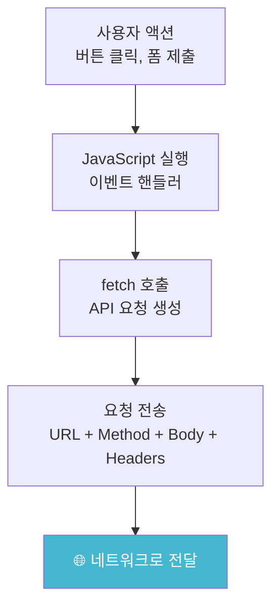
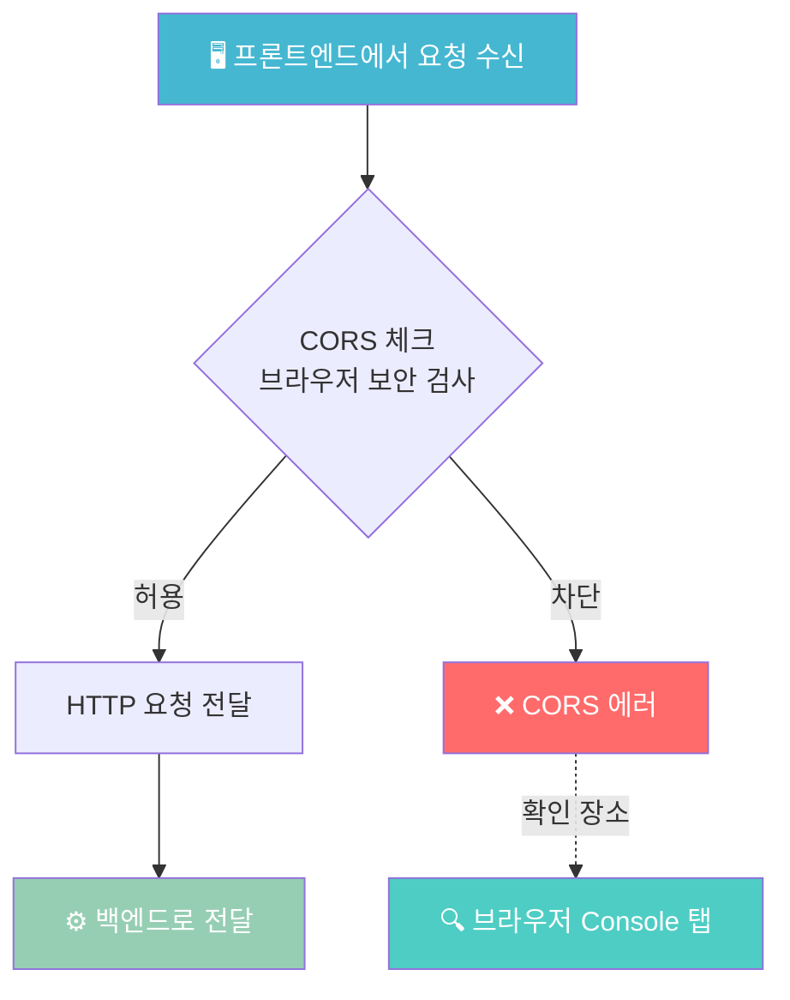
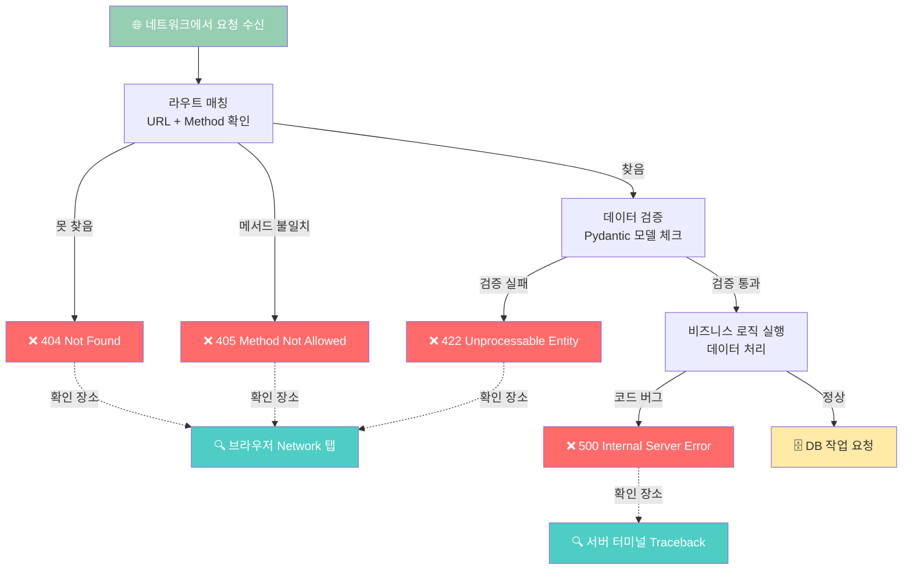
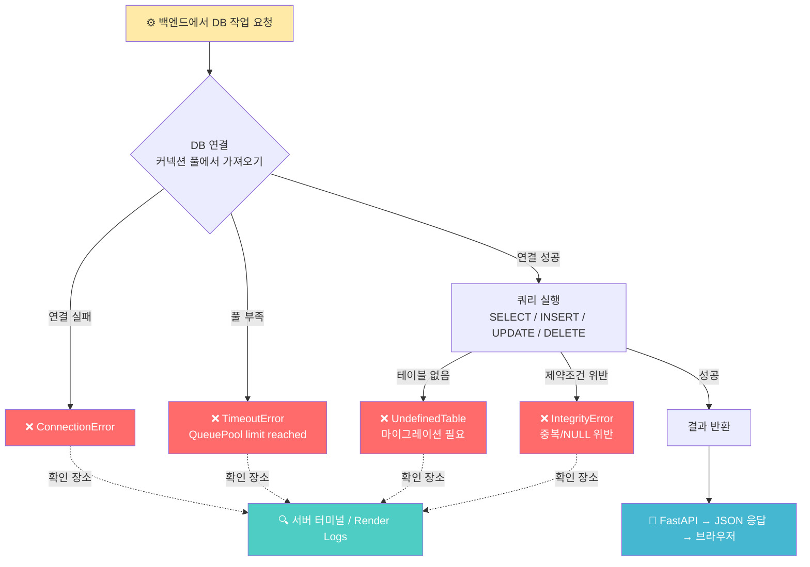
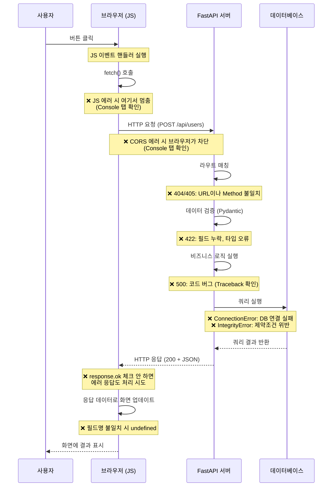
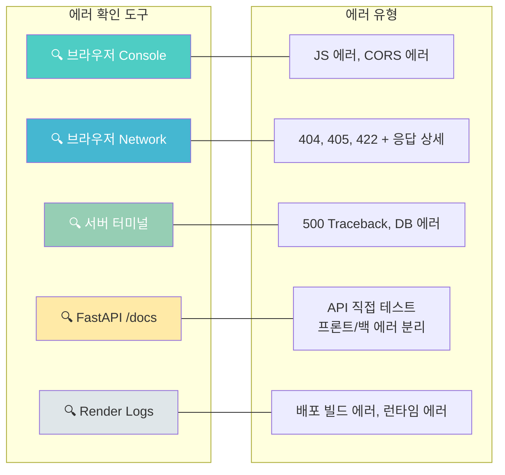
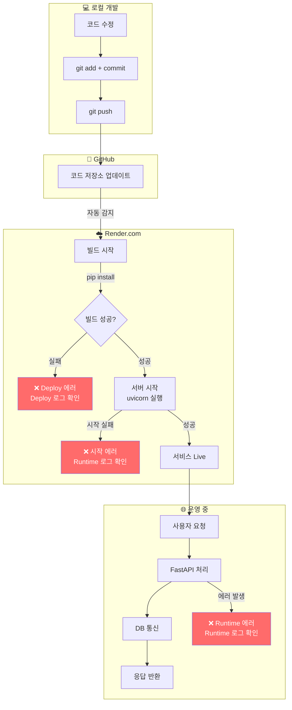

# 데이터 플로우 다이어그램: FE → 서버 → DB 에러 발생 지점

## 전체 데이터 흐름과 에러 발생 지점

> 전체 흐름을 4개 구간으로 나누어 표시합니다: 프론트엔드 → 네트워크 → 백엔드 → 데이터베이스

### 1단계: 프론트엔드 (브라우저)

> **용어 설명**
>
> - **fetch 호출**: JavaScript에서 서버에 데이터를 요청하는 함수입니다. `fetch('/api/users')` 처럼 사용하며, "이 주소로 가서 데이터를 가져와줘"라는 뜻입니다. 브라우저가 서버와 통신하는 거의 유일한 방법입니다.
> - **API 요청 생성**: 서버에 보낼 "편지"를 작성하는 것과 같습니다. 어디로 보낼지(URL), 무엇을 할지(Method: GET=조회, POST=생성), 어떤 데이터를 담을지(Body), 추가 정보(Headers)를 함께 포장합니다.
> - **이벤트 핸들러**: "이 버튼을 클릭하면 이 함수를 실행해줘"처럼, 사용자의 행동(클릭, 입력 등)에 반응해서 실행되는 JavaScript 함수입니다.

### 2단계: 네트워크 (CORS 검사)

> **용어 설명**
>
> > - **CORS (Cross-Origin Resource Sharing)**: 브라우저의 보안 정책입니다. 예를 들어 `localhost:3000`(프론트)에서 `localhost:8000`(서버)으로 요청하면, 주소가 다르기 때문에 브라우저가 "이 서버가 허락한 요청인지" 먼저 확인합니다. 서버가 허락하지 않으면 브라우저가 요청을 차단하고, Console에 빨간 에러가 뜹니다.
>
> - **우리 회사 예시**: `interiorteacher.com`에서 `api.interiorteacher.com`으로 요청하면 주소(Origin)가 다르므로 CORS 체크가 발생합니다. 이 경우 `api.interiorteacher.com` 서버에서 `interiorteacher.com`의 요청을 허용하도록 설정되어 있기 때문에 정상 통과됩니다. 반면, 지금 이 학습 앱처럼 서버(FastAPI)가 직접 HTML/CSS/JS를 서빙하는 경우에는 페이지와 API가 같은 주소·포트에서 제공되므로 Same-Origin으로 취급되어 CORS 체크 자체가 발생하지 않습니다.
> - **Preflight 요청**: CORS 검사의 한 단계입니다. 브라우저가 본 요청을 보내기 전에 "이런 요청을 보내도 될까요?"라고 서버에 미리 확인(OPTIONS 요청)하는 과정입니다. 서버가 "OK"라고 응답해야 실제 요청이 전달됩니다.
> - **왜 로컬에서는 되고 배포하면 안 되나요?**: 로컬에서는 같은 주소(`localhost`)를 쓰지만, 배포하면 프론트(`myapp.com`)와 서버(`api.myapp.com`)의 주소가 달라지기 때문입니다. 서버의 CORS 설정에 배포 도메인을 추가해야 합니다.

### 3단계: 백엔드 (FastAPI)

> **용어 설명**
>
> - **라우트 매칭**: 요청이 들어오면 서버가 "이 URL과 Method를 처리하는 함수가 있는지" 찾는 과정입니다. 예를 들어 `POST /api/users`로 요청했는데 서버에 그런 경로가 없으면 404, GET만 정의되어 있으면 405가 발생합니다.
> - **데이터 검증 (Pydantic 모델 체크)**: 요청 데이터가 서버가 기대하는 형식과 맞는지 자동으로 확인하는 단계입니다. 예를 들어 나이(`age`)에 숫자를 보내야 하는데 `"스물"`이라는 문자열을 보내면 422 에러가 발생합니다. FastAPI가 Pydantic이라는 라이브러리를 사용해서 이 검증을 자동으로 해줍니다.
> - **비즈니스 로직 실행**: 실제로 우리가 작성한 Python 코드가 실행되는 단계입니다. 회원가입 처리, 주문 생성, 데이터 계산 등 "앱이 실제로 하는 일"을 말합니다. 여기서 코드에 버그가 있으면 500 에러가 발생합니다.

### 4단계: 데이터베이스

---

## 요청(Request) 흐름 상세

---

## 에러 확인 장소 요약

---

## 배포 환경에서의 데이터 흐름

