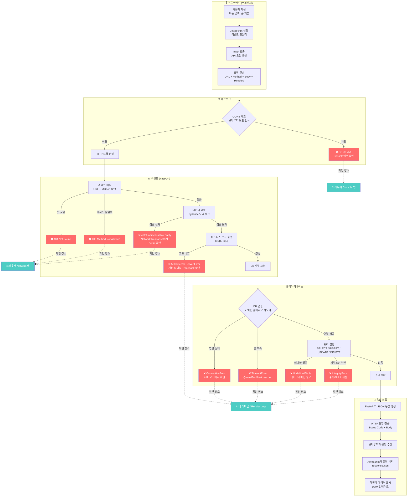
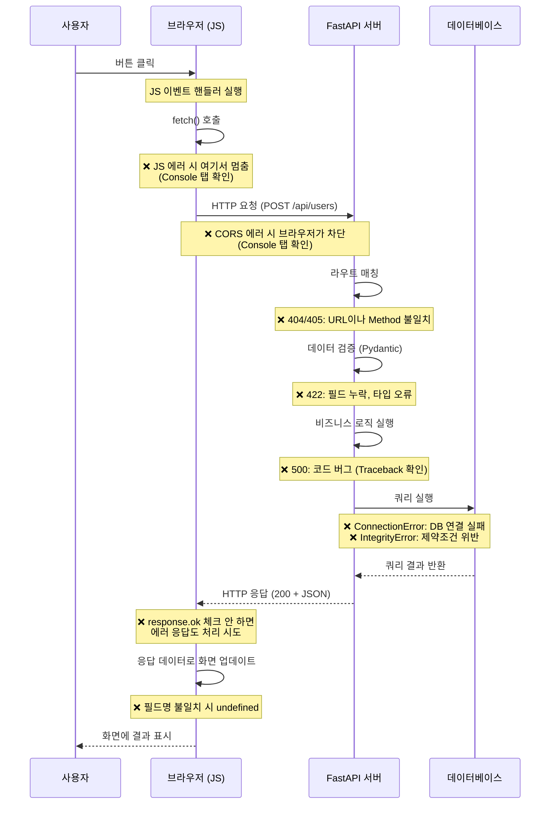
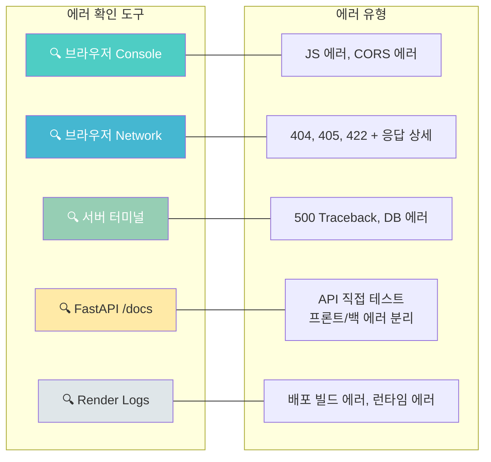
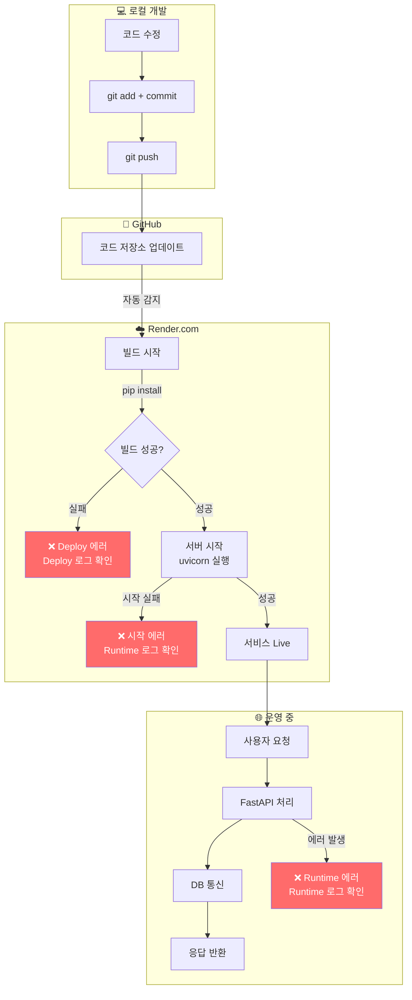

# 데이터 플로우 다이어그램: FE → 서버 → DB 에러 발생 지점

> 이 파일의 Mermaid 다이어그램은 GitHub에서 자동으로 렌더링됩니다.
> 로컬에서 미리보기하려면 VS Code의 "Markdown Preview Mermaid Support" 확장을 설치하세요.

---

## 전체 데이터 흐름과 에러 발생 지점

---

## 요청(Request) 흐름 상세

---

## 에러 확인 장소 요약

---

## 배포 환경에서의 데이터 흐름

